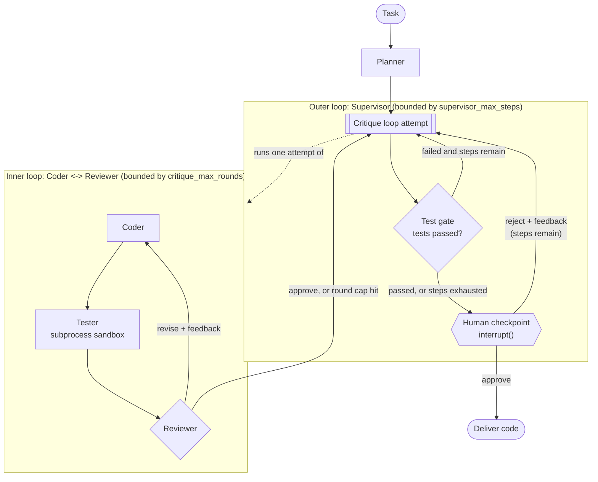

# Multi-Agent Code Generation & Review System

A multi-agent system that plans, writes, executes, and reviews code for a
given task. It composes two orchestration patterns on LangGraph:

- a **supervisor** that routes the overall run (Planner, then the critique loop, then a test gate, then a human checkpoint), and
- a bounded **debate/critique loop** between a Coder and a Reviewer that refines the code inside one of those steps.

Before delivery the run pauses for a human to approve, or to reject with feedback, which loops back into the Coder.

## Architecture



| Agent | Role | Uses an LLM? |
|---|---|---|
| Supervisor | Routes macro steps from state (test pass/fail, human decision, step counts) | No, plain conditional edges |
| Planner | Task into a step-by-step plan | Yes |
| Coder | Plan (+ Reviewer/human feedback) into a runnable script with self-checking asserts | Yes |
| Tester | Executes the script in a subprocess sandbox; reports pass/fail, stdout, stderr | No, it runs the code |
| Reviewer | Critiques code + test result; approves or sends back specific feedback | Yes |

### Why both patterns, and how they compose

They solve different problems.

- **Supervisor (macro).** The run has distinct phases and branching that depends on outcomes: did tests pass, did the human approve, how many attempts remain. That logic belongs in one place (`route_after_test_gate`, `route_after_human_checkpoint` in [`graph/supervisor.py`](graph/supervisor.py)) rather than spread across agents.
- **Critique loop (micro).** Refining one artifact is a tight proposer/critic cycle. A second pass with concrete test output catches errors a single generation misses.

They compose cleanly because, from the supervisor's view, the whole critique loop is a single node. It receives a plan and returns code, a test result, and a verdict, so the supervisor never needs to know the inner loop iterates. Each supervisor retry gets a **fresh** set of critique rounds. The two bounds (`supervisor_max_steps`, `critique_max_rounds`) are independent, so one can't eat into the other. A human rejection is bounded by the supervisor limit too, so it can't force unbounded retries.

## Quickstart

```bash
uv sync
cp .env.example .env        # set LLM_PROVIDER and the matching API key
uv run python -m cli.main "Write a function is_palindrome(s) that ignores case and punctuation."
uv run python -m cli.trace_view          # view the most recent run's trace
uv run pytest tests/                     # tests (several call the live LLM)
```

The LLM backend is pluggable via `LLM_PROVIDER` = `groq` | `gemini` | `ollama` (default models in [`agents/llm.py`](agents/llm.py)), and each agent role can be overridden (for example `CODER_LLM_PROVIDER`). Model availability changes on free tiers. During this build several model names were retired or had tiny quotas, so set `LLM_MODEL` explicitly if a default stops working.

## Web UI

A browser UI shows the agents working live and lets you approve or reject at the checkpoint.

```bash
uv run uvicorn api.server:app --port 8000     # then open http://localhost:8000
```

You get a live timeline (Planner, Coder, Tester, Reviewer, with diffs and errors expandable), a review screen with the code, test output, Reviewer verdict and critique history, and approve/reject-with-feedback controls. If a rejection would end the run because no retry steps are left, the UI says so and lets you grant extra steps. Reloading the page reconnects to the run in progress.

The frontend is a static page in [`web/`](web/) with no build step. The API is a FastAPI app ([`api/server.py`](api/server.py)) that runs each session on a background thread and keeps its state in memory. The frontend polls it once a second.

### Deploying

Vercel's serverless functions can't host the backend. Runs last minutes, sessions live in process memory, and the Tester spawns subprocesses. So split it: the frontend goes on Vercel and the backend on a host that runs a long-lived container. Render has a free plan that runs the included [`Dockerfile`](Dockerfile) (it sleeps after 15 idle minutes, and a sleeping service loses in-memory sessions).

Do the steps in this order, because each URL is needed by the next step:

1. **Vercel (frontend).** Import this repo, set **Root Directory** to `web`, framework preset "Other", no build command. Note the resulting URL.
2. **Render (backend).** New, then Blueprint, pick this repo. [`render.yaml`](render.yaml) defines the service. Render asks for three values: `GOOGLE_API_KEY` (your model key), `ACCESS_CODE` (a long random string you generate, for example `python -c "import secrets; print(secrets.token_urlsafe(18))"`), and `CORS_ORIGINS` (the Vercel URL from step 1, no trailing slash). Note the Render URL.
3. **Point the frontend at the backend.** Set `apiBase` in [`web/config.js`](web/config.js) to the Render URL, commit and push. Vercel redeploys.

The Dockerfile and Blueprint have not been built or deployed from the environment this project was developed in, so expect to fix small things on the first deploy.

**Before you make a public deployment, read this.** The server executes code an LLM wrote, and anyone who can reach it can steer what gets written. The sandbox is a plain subprocess (see Limitations), not a security boundary. Anyone using it also spends your model API quota. Set `ACCESS_CODE` so only people you share it with can start runs, and `MAX_ACTIVE_SESSIONS` to cap concurrency. The container is your isolation layer, so don't run this on a machine that holds anything you care about.

## Example runs

Generated by [`scripts/generate_examples.py`](scripts/generate_examples.py) against the real pipeline (Gemini `gemini-flash-lite-latest`). Full traces and delivered code are in [`docs/traces/`](docs/traces/).

### 1. Clean success ([full trace](docs/traces/easy.md))

```
- Planner: generated initial plan
- Critique loop (supervisor step 1): 1 round(s), outcome=approve
    - round 1 Coder (wrote_code): 'initial implementation from plan'
    - round 1 Tester: passed (exit 0)
    - round 1 Reviewer: approve - 'The implementation is correct, clean, and all test cases passed successfully.'
- Test gate: passed
- Human checkpoint: approve
```

### 2. Multiple critique rounds ([full trace](docs/traces/multi_round.md))

Round 1's Tester result was **fault-injected** to fail, so the revise path is exercised deterministically. Round 2's failure was **not** injected. The Coder rewrote the code but wrote a wrong assertion expectation of its own, and the real Tester caught it.

```
- Critique loop (supervisor step 1): 3 round(s), outcome=approve
    - round 1 Tester: FAILED (exit 1)                      <- injected
    - round 1 Reviewer: revise - 'The test execution failed due to a forced test failure ...'
    - round 2 Coder (revised_code): <reviewer feedback>
    - round 2 Tester: FAILED (exit 1)                      <- real failure
    - round 2 Reviewer: revise - "The assertion for 'Python Programming!' failed because ... actually contains 4 vow..."
    - round 3 Coder (revised_code): <reviewer feedback>
    - round 3 Tester: passed (exit 0)
    - round 3 Reviewer: approve
- Test gate: passed
- Human checkpoint: approve
```

### 3. Human rejection ([full trace](docs/traces/human_rejection.md))

The code passed its tests and the Reviewer approved it. The human rejected it on quality grounds, and the feedback flowed into a fresh critique-loop attempt.

```
- Critique loop (supervisor step 1): 1 round(s), outcome=approve
- Test gate: passed
- Human checkpoint: reject
- Critique loop (supervisor step 2): 1 round(s), outcome=approve
    - round 1 Coder (wrote_code): 'Add a complete docstring to the square function explaining its parameter and return value.'
- Test gate: passed
- Human checkpoint: approve
```

## Iteration and timing stats

One run per scenario, so this is illustrative rather than statistical. Wall time excludes human think time.

| Scenario | Supervisor steps | Critique rounds per step | Wall time | Coder | Reviewer | Tester |
|---|---|---|---|---|---|---|
| Easy (`is_even`) | 1 | [1] | 6.4s | 2.1s | 1.7s | 0.06s |
| Medium (`merge_intervals`) | 1 | [1] | 9.5s | 3.2s | 2.0s | 0.04s |
| Hard (`next_greater_circular`) | 1 | [1] | 10.7s | 4.8s | 2.2s | 0.04s |
| Multi-round (`count_vowels`, first test injected) | 1 | [3] | 16.9s | 7.4s | 6.5s | 0.08s |
| Human rejection (`square`) | 2 | [1, 1] | 22.9s | 6.7s | 3.4s | 0.09s |

Nearly all wall-clock time is LLM calls. Code execution and supervisor routing are negligible, so the cost of an extra loop iteration is one Coder call plus one Reviewer call. Raw numbers are in [`docs/traces/stats.json`](docs/traces/stats.json).

## Observability

Every agent action and supervisor decision is appended to a shared `trace` (timestamp, agent, reason). The Coder logs a diff against its previous version and the feedback that triggered it. `cli.main` saves each run to `logs/<run_id>.json`, and `cli.trace_view` renders the decision path (macro steps with their nested critique rounds) plus a time-per-agent table. This is the kind of trajectory data an eval/observability tool would consume: which agents ran, how many iterations, and where time went, independent of final-output correctness.

## Testing

`uv run pytest tests/` runs 39 tests (`-k "not live and not e2e"` runs the 31 that don't call the LLM). Deterministic tests mock the agents to verify routing and loop bounds independent of LLM behavior. Live tests run the real pipeline. `tests/test_e2e.py` covers easy/medium/hard tasks, a multi-round critique, a supervisor-level retry after a test failure, and a human rejection whose feedback is verified to appear in the revised code. The multi-round and supervisor-retry e2e tests fault-inject one Tester result, since a real model's mistakes can't be reproduced on demand. The Coder and Reviewer remain real.

## Limitations

- **Sandbox depth.** Execution is a local subprocess with a temp dir, wall-clock timeout, stripped environment, and best-effort CPU/memory rlimits. There is no network or filesystem isolation and no syscall filtering. It is suitable for running your own LLM-generated code locally, not for adversarial code. Use containers or a VM for anything shared or untrusted. The `RLIMIT_AS` memory cap is also not reliably enforced on macOS.
- **The Reviewer doesn't see the task or plan.** It judges only the code and its test result, so it can't flag a violation of a requirement that the code's own asserts don't check (for example "don't use built-in sort"). Passing the task and plan to the Reviewer is the obvious fix.
- **"Tests" are written by the Coder.** The Tester runs whatever asserts the Coder wrote. If the Coder writes a wrong expectation, tests pass or fail for the wrong reason. This actually happened in the multi-round example above. Independent test generation would be more robust.
- **Live tests are non-deterministic.** In the final full run, 2 of 26 live e2e tests failed (`test_e2e_hard_task`, `test_e2e_multi_round_critique_with_real_agents`) and both passed on immediate rerun. Model output varies run to run, and the multi-round test has little slack because the injected failure uses up one round. I gave that test one extra round afterward but did not re-run the full suite again. Expect occasional flakes in the live tests. The deterministic tests are stable.
- **Approval on first pass is common.** On these tasks the model produced correct code in one round each time, including the "hard" one, so the multi-round scenarios rely on fault injection for determinism. These tasks don't show how the loop behaves on problems that are genuinely hard for the model.
- **Model choice and quotas.** Free tiers changed under this build. Groq's daily token limit was exhausted mid-project, and several Gemini models were retired or capped at 20 requests/day. Results depend on the model in use, and I only ran the full suite on the models named above.
- **Loop bounds are heuristics.** Defaults (3 critique rounds, 3 supervisor steps) were chosen without tuning. When a bound is hit, the system delivers its best attempt to the human, flagged as failing, rather than erroring.
- **Session state is in memory.** The human checkpoint uses `MemorySaver`, so a paused run doesn't survive process restarts.

## Lessons learned

- **Keep bounds independent.** Resetting the critique-round counter on each supervisor retry keeps the two limits meaningful. Sharing one counter would make retries start near the cap.
- **A checkpointer is required for a useful interrupt.** `interrupt()` works without one, but you can't resume across invocations. `MemorySaver` plus a thread id makes pause and resume behave.
- **Normalize LLM output at one seam.** Some Gemini models return `content` as a list of blocks rather than a string, which silently broke regex/JSON parsing. A single `extract_text` helper fixed it for every agent.
- **Fail safe on parse errors.** An unparseable Reviewer response defaults to "revise", never "approve", so a formatting glitch can't ship unreviewed code.
- **Test routing separately from model quality.** Mocked agents verify the control flow deterministically. Live runs verify the wiring. Fault injection reproduces failure paths that real models rarely hit on cue.
- **Give the reviser its own previous output.** The first version of the Coder rewrote from the plan plus feedback text without seeing its earlier code, so it kept reintroducing bugs it had just fixed. On a hard expression-evaluator task one run went 3 steps and 7 rounds before passing. After the Coder was given its previous code, one re-run took 1 step and 2 rounds. That is a single sample, not a benchmark.
- **Make dead ends visible to the human.** A rejection that hit the step limit used to end the run silently with unchanged code. The checkpoint now reports the retry budget, lets the human grant extra steps, and flags a rejection that could not be applied.
- **Log the reason, not just the event.** Recording why each retry happened (test failure text, human feedback) and what changed (diff) makes traces useful for diagnosis.
- **Free-tier APIs are a project risk.** Model names and quotas moved during this build, so the pluggable backend paid for itself.

## Project layout

```
agents/     Planner, Coder, Tester, Reviewer, pluggable LLM backend
api/        FastAPI server and in-memory session manager for the web UI
web/        static frontend (no build step)
graph/      state schema, critique loop, supervisor, trace + observability helpers
sandbox/    subprocess code executor
cli/        interactive human-approval CLI and trace viewer
scripts/    example-trace generator
tests/      deterministic and live tests
docs/       Phase 0 study notes, example traces
```

See [`build-brief-multi-agent-code-system.md`](build-brief-multi-agent-code-system.md) for the original brief and [`PROGRESS.md`](PROGRESS.md) for the phase-by-phase build log.
